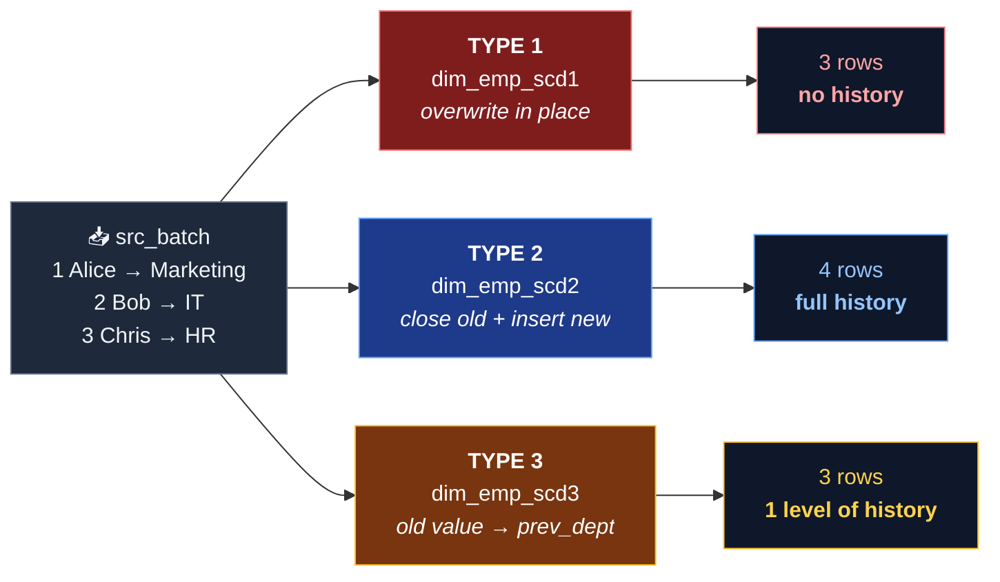
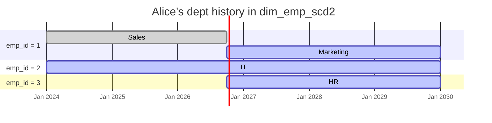
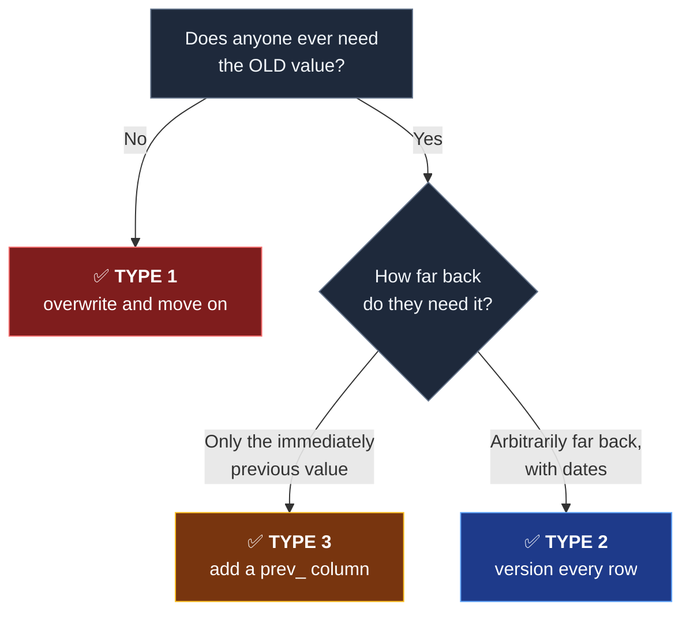

<div align="center">


<br />

# SCD Type 1 · Type 2 · Type 3 on Databricks

**The smallest possible, fully-runnable demo of Slowly Changing Dimensions — three Delta tables, one incoming batch, five `MERGE` statements, zero setup pain.**

<br />


<br />

<a href="#-quickstart"><b>Quickstart</b></a> ·
<a href="#-the-scenario"><b>Scenario</b></a> ·
<a href="#-side-by-side-results"><b>Results</b></a> ·
<a href="#-how-each-type-works"><b>How it works</b></a> ·
<a href="#-cheat-sheet"><b>Cheat sheet</b></a> ·
<a href="#-gotchas--production-notes"><b>Gotchas</b></a>

</div>

---

## 💡 Why this exists

Every SCD tutorial is either **40 slides of theory** or a **900-line production framework** with config files, orchestration and a metadata-driven merge generator.

This repo is the middle ground that almost never exists: **one notebook you can paste into Databricks Community Edition, run top-to-bottom, and actually *watch* history being created.** No cluster config, no data to download, no Unity Catalog required.

> **Ideal for:** data engineers learning dimensional modelling, interview prep, bootcamp demos, and as a copy-paste starting point for a real pipeline.

### What you get

| | |
|---|---|
| 📓 **1 Databricks notebook** (`.py` in Databricks source format — importable in one click) | 3 target Delta tables + 1 source batch, all created from scratch |
| 🔁 **3 SCD strategies** implemented with plain Delta `MERGE` | Type 1 overwrite · Type 2 row versioning · Type 3 previous-value column |
| 🧪 **Re-runnable** | Re-run the Setup cell any time to reset everything to its initial state |
| 🆓 **Free-tier friendly** | Runs as-is on Databricks Community Edition — no external storage, no secrets |
| 🧠 **Side-by-side output** | All three results printed next to each other at the end so the difference is impossible to miss |

---

## 🚀 Quickstart

**1. Import the notebook**

> Databricks workspace → <kbd>Workspace</kbd> → right-click → <kbd>Import</kbd> → upload `notebooks/scd_demo_databricks.py`

*(Prefer copy-paste? Open the file, paste the whole thing into a blank notebook cell — Databricks will split it into cells automatically from the `# COMMAND ----------` markers.)*

**2. Attach to any cluster** (even the smallest single-node one — this demo uses ~3 rows of data)

**3. Run it**

> <kbd>Run All</kbd>

That's it. There is no step 4. The Setup cell creates a `scd_demo` schema, builds the three tables, and registers the incoming batch as a temp view.

<details>
<summary><b>No Databricks account? Run the logic locally in 5 lines.</b></summary>

The `MERGE` statements need Delta Lake, but you can get the identical behaviour on your laptop:

```bash
pip install "delta-spark==3.*" pyspark
```

```python
from delta import configure_spark_with_delta_pip
from pyspark.sql import SparkSession

builder = (
    SparkSession.builder
    .appName("scd-demo")
    .config("spark.sql.extensions", "io.delta.sql.DeltaSparkSessionExtension")
    .config("spark.sql.catalog.spark_catalog", "org.apache.spark.sql.delta.catalog.DeltaCatalog")
)
spark = configure_spark_with_delta_pip(builder).getOrCreate()
```

Then paste the notebook cells one after another into your REPL. Substitute `display(df)` with `df.show()`.

</details>

---

## 🎬 The scenario

A dimension table `dim_emp` where the attribute **`dept`** changes over time. Three employees arrive in the source system:

| emp_id | name | `dept` before | `dept` in incoming batch | What happened |
|:---:|:---|:---:|:---:|:---|
| `1` | Alice | `Sales` | `Marketing` | 🔄 **changed** |
| `2` | Bob | `IT` | `IT` | ✅ **unchanged** |
| `3` | Chris | *— row doesn't exist —* | `HR` | 🆕 **new row** |

That's the whole test matrix: **one update, one no-op, one insert.** Every SCD type has to handle all three cases, and they handle them *very* differently.

<div align="center">



</div>

---

## 📊 Side-by-side results

> `run_date` = the day you run the notebook (`current_date()`).

### Before — all three tables start identical

| emp_id | name | dept |
|:---:|:---|:---|
| 1 | Alice | Sales |
| 2 | Bob | IT |

### After — three strategies, three very different tables

<details open>
<summary><b>🔴 Type 1 — <code>dim_emp_scd1</code></b> · overwrite, history destroyed</summary>

| emp_id | name | dept | note |
|:---:|:---|:---|:---|
| 1 | Alice | **Marketing** | ⚠️ `Sales` is gone forever |
| 2 | Bob | IT | unchanged |
| 3 | Chris | HR | inserted |

</details>

<details open>
<summary><b>🔵 Type 2 — <code>dim_emp_scd2</code></b> · new row per version, full history</summary>

| emp_id | name | dept | eff_start | eff_end | is_current |
|:---:|:---|:---|:---|:---|:---:|
| 1 | Alice | Sales | 2024-01-01 | *run_date − 1* | ❌ false |
| 1 | Alice | **Marketing** | *run_date* | 9999-12-31 | ✅ **true** |
| 2 | Bob | IT | 2024-01-01 | 9999-12-31 | ✅ true |
| 3 | Chris | HR | *run_date* | 9999-12-31 | ✅ true |

Alice now occupies **two rows**. A downstream join filters on `is_current`; an analyst doing point-in-time reporting filters on `eff_start <= d AND eff_end >= d`.

</details>

<details open>
<summary><b>🟡 Type 3 — <code>dim_emp_scd3</code></b> · previous value parked in a column</summary>

| emp_id | name | dept | prev_dept |
|:---:|:---|:---|:---|
| 1 | Alice | **Marketing** | **Sales** |
| 2 | Bob | IT | *null* |
| 3 | Chris | HR | *null* |

Same row count as Type 1, but Alice remembers where she came from — **exactly one step back.** Change her department again tomorrow and `Sales` is overwritten by `Marketing`.

</details>

---

## 🔍 How each type works

### 🔴 Type 1 — Overwrite

Latest value wins. The old value is **lost**. Use it when history doesn't matter — correcting a typo, storing non-sensitive attributes, or reprocessing a bad load.

```sql
MERGE INTO dim_emp_scd1 t
USING src_batch s
ON t.emp_id = s.emp_id
WHEN MATCHED THEN UPDATE SET name = s.name, dept = s.dept
WHEN NOT MATCHED THEN INSERT (emp_id, name, dept) VALUES (s.emp_id, s.name, s.dept)
```

One statement, two clauses, done. This is the cheapest possible dimension load.

---

### 🔵 Type 2 — Row versioning

Every version gets a validity window (`eff_start` / `eff_end`) plus an `is_current` flag. Implemented here as **two simple `MERGE`s** — deliberately split, because it makes the two phases obvious:

```sql
-- Step 1 — CLOSE the current row of anything that changed
MERGE INTO dim_emp_scd2 t
USING src_batch s
ON t.emp_id = s.emp_id AND t.is_current = true
WHEN MATCHED AND (t.dept <> s.dept OR t.name <> s.name)
  THEN UPDATE SET is_current = false, eff_end = date_sub(current_date(), 1)

-- Step 2 — INSERT the new current version
MERGE INTO dim_emp_scd2 t
USING src_batch s
ON t.emp_id = s.emp_id AND t.is_current = true
WHEN NOT MATCHED
  THEN INSERT (emp_id, name, dept, eff_start, eff_end, is_current)
       VALUES (s.emp_id, s.name, s.dept, current_date(), DATE '9999-12-31', true)
```

**Why two statements instead of one clever one?** Because Step 2's `NOT MATCHED` only fires for a key once Step 1 has closed its old row. That's the whole trick — and it means Bob (unchanged) is silently skipped, while Chris (brand new) falls straight through to the insert.



**Reading the history:**

```sql
-- "What does the dimension look like right now?"
SELECT * FROM dim_emp_scd2 WHERE is_current

-- "What did the dimension look like on 2024-06-01?"  (point-in-time / as-of join)
SELECT * FROM dim_emp_scd2
WHERE DATE '2024-06-01' BETWEEN eff_start AND eff_end
```

---

### 🟡 Type 3 — Previous-value column

Still one row per entity, but a `prev_dept` column holds the old value. The key insight is that **on the right-hand side of `SET`, the column reference still points at the target row**:

```sql
MERGE INTO dim_emp_scd3 t
USING src_batch s
ON t.emp_id = s.emp_id
WHEN MATCHED AND t.dept <> s.dept
  THEN UPDATE SET name = s.name, dept = s.dept, prev_dept = t.dept   -- t.dept = the OLD value
WHEN NOT MATCHED
  THEN INSERT (emp_id, name, dept, prev_dept)
       VALUES (s.emp_id, s.name, s.dept, CAST(NULL AS STRING))
```

`prev_dept = t.dept` pushes the outgoing value sideways. Cheap, no table growth — but only **one** level of history. Perfect for *"show me this quarter's region vs. last quarter's region"* reports where you'd otherwise self-join a Type 2 table.

---

## 📋 Cheat sheet

| | 🔴 Type 1 | 🔵 Type 2 | 🟡 Type 3 |
|---|:---:|:---:|:---:|
| **What happens** | `UPDATE` in place | `INSERT` new row + close old row | `UPDATE` in place, old value moves to a column |
| **History kept** | none | **full**, arbitrary length | **only the previous value** |
| **Rows for Alice after 1 change** | 1 | 2 | 1 |
| **Table growth** | none | grows on every change | none |
| **Storage / compute cost** | 💚 cheapest | 💸 highest | 💚 cheap |
| **Query complexity** | trivial | needs `is_current` or as-of filter | trivial |
| **Statements needed** | 1 `MERGE` | 2 `MERGE`s | 1 `MERGE` |
| **Typical use case** | typo fixes, non-sensitive attributes | audit trails, conformed dimensions, compliance | *"previous region / segment"* reports |
| **Killer feature** | dead simple | time travel over business attributes | no join needed to compare old vs. new |
| **Biggest weakness** | destroys data | table grows forever | forgets everything after one hop |

### Choosing quickly



---

## ⚠️ Gotchas & production notes

Things this minimal demo glosses over on purpose — know them before you ship it.

- **🔒 `MERGE` is atomic.** Delta gives you ACID guarantees: either the whole merge applies, or nothing does. No half-closed rows if a job dies mid-merge.
- **🕳️ NULL-safe comparisons.** If a tracked column can be `NULL`, `t.dept <> s.dept` evaluates to `NULL` (not `true`) and the update silently never fires. Use the null-safe operator: `NOT (t.dept <=> s.dept)`.
- **👤 Type 3 ignores name-only changes.** The clause is `WHEN MATCHED AND t.dept <> s.dept` — so if Alice's *name* changes but her department doesn't, the row is skipped entirely. Add `OR t.name <> s.name` if you need name sync. *(Type 2 already handles this correctly.)*
- **⏱️ The `date_sub(current_date(), 1)` convention.** It produces contiguous, non-overlapping windows (`old.eff_end` = `new.eff_start − 1`). If you instead set `eff_end = eff_start` of the new row, your as-of joins must switch from `BETWEEN` to `>= / <` half-open ranges. Pick one and be consistent.
- **🔑 De-duplicate your source.** Delta's `MERGE` errors if the source matches a target row more than once. A batch with two rows for `emp_id = 1` will blow up — dedupe with `row_number()` on a load timestamp first.
- **🗑️ No delete handling.** This demo never removes anyone. Real pipelines need `WHEN NOT MATCHED BY SOURCE` (soft-delete by closing the row) or a CDC feed with explicit `DELETE` operations.
- **📈 Type 2 tables grow forever.** Add `OPTIMIZE ... ZORDER BY (emp_id)` on a schedule, and consider a retention policy for closed rows.
- **🔁 Idempotency.** Re-running the *same* Type 2 batch is harmless (Step 1 finds nothing to close, Step 2 finds nothing to insert), but only because the source is unchanged. Reprocessing an *older* batch out of order will corrupt your windows.
- **🚀 Want the fast path?** Databricks has `APPLY CHANGES INTO` (Delta Live Tables / Lakeflow Declarative Pipelines) which does all of this — Type 1 and Type 2, with sequencing and deletes — declaratively. Learn it here by hand first, then let the framework do it.

---

## 🗂️ Project structure

```
.
├── README.md
├── assets/
│   └── banner.png
└── notebooks/
    └── scd_demo_databricks.py   # Databricks source-format notebook — import directly
```

**Notebook layout:**

| Cell | Section | What it does |
|:---:|---|---|
| 0 | **Setup** | Creates schema `scd_demo`, drops + recreates the 3 target tables, builds `src_batch` temp view |
| 1 | **SCD Type 1** | `MERGE` → overwrite; prints result |
| 2 | **SCD Type 2** | Two `MERGE`s → close + insert; prints full history and current-only view |
| 3 | **SCD Type 3** | `MERGE` → push old value to `prev_dept`; prints result |
| 4 | **Side-by-side** | All three tables printed together for comparison |
| 5 | **Cheat sheet** | When to use what, plus tips |

---

## ✅ Requirements

| | |
|---|---|
| **Platform** | Any Databricks workspace — including **Community Edition** (free) |
| **Compute** | DBR 7.3+ (needs `MERGE INTO` on Delta) — any cluster size |
| **Storage** | None external; tables are written to the workspace's managed location |
| **Permissions** | `CREATE SCHEMA` in `hive_metastore` or a Unity Catalog schema |
| **Libraries** | None — pure Spark SQL + PySpark |

> **Unity Catalog or `hive_metastore`?** The Setup cell tries `CREATE SCHEMA IF NOT EXISTS scd_demo` and gracefully falls back to your current default schema if it can't. Either way the demo runs.

---

## 🤝 Contributing

Contributions are very welcome — especially if they make the demo clearer without making it longer.

```bash
git clone https://github.com/<your-username>/scd-demo-databricks.git
cd scd-demo-databricks
```

Ideas worth adding:

- [ ] SCD **Type 4** (history table) and **Type 6** (1 + 2 + 3 hybrid)
- [ ] A CDC-driven version that handles deletes via `WHEN NOT MATCHED BY SOURCE`
- [ ] A `dlt` / Lakeflow `APPLY CHANGES INTO` equivalent of the same scenario
- [ ] Snapshot of expected outputs as a test fixture

**One rule:** it should stay runnable end-to-end in under a minute on the free tier.

---

## 📄 License

Licensed under the [MIT License](LICENSE) — use it, fork it, teach with it.

---

<div align="center">

**Built to make SCDs click in one run, not one afternoon.**

<i>Found this useful? A ⭐ on the repo is the cheapest thank-you there is.</i>

<br /><br />

<sub>Tags: `databricks` · `delta-lake` · `apache-spark` · `pyspark` · `slowly-changing-dimensions` · `scd-type-2` · `data-warehouse` · `dimensional-modeling` · `data-engineering` · `merge`</sub>

</div>
